# Guide

## Changing themes

Click on the palette icon at the top left corner to toggle between the themes.

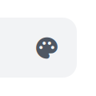
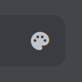

## Navigating

Use the buttons at the end of each chapter to go to the previous/next chapter
or you can use the `🠐` and `🠒` keys to go to the previous or next chapter respectively.

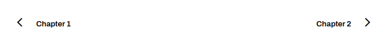
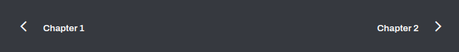

## Search 

Start typing in the *cute* little text field under the `Unofficial Discord Documentation` to search for something.

Example of a query with no results:

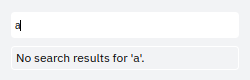
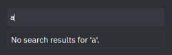

Example of a query with results (can scroll to see more):

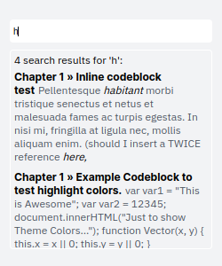
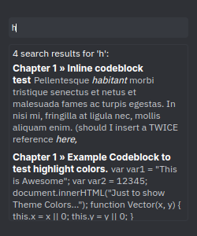

## Opening/Closing the sidebar

To contract or expand the sidebar, you can click the `☰` button besides it.

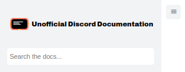
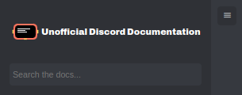

## Making changes to chapters

You can click the folder icon to go to the repository, and the pen/pencil icon
to edit or propose changes to the chapter. 

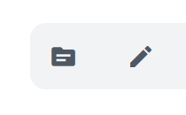
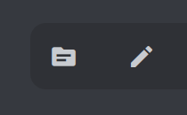
